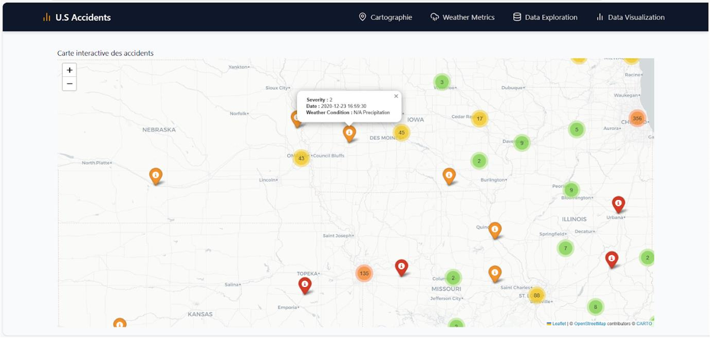
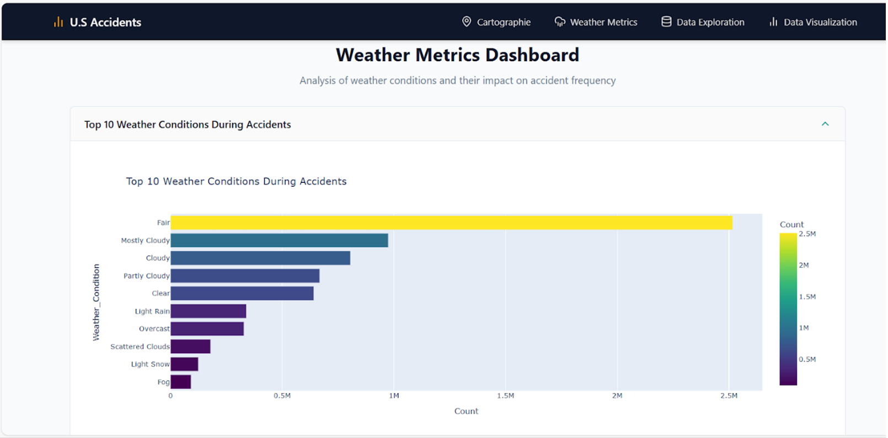

# Road Accidents Visualization & Classification

## 📌 Overview
This project analyzes the **US Accidents Dataset** from [Kaggle](https://www.kaggle.com/datasets/sobhanmoosavi/us-accidents) to:
- Identify patterns and trends in road accidents.
- Predict accident severity using machine learning models.
- Provide an interactive dashboard for data exploration.

## 🚀 Features
- **EDA**: Temporal, geographical, and weather-related analysis.
- **ML Models**: Decision Tree, Random Forest, and XGBoost.
- **Encoding Tests**: Label Encoding vs. One-Hot & Binary Encoding.
- **Balancing Tests**: SMOTE, undersampling, and class-weight adjustments.
- **Interactive Dashboard**: Map, weather metrics, and severity analysis.

## 🗂 Project Structure
```
notebooks/        → Jupyter notebooks for EDA & modeling
dashboard/        → React (Vite) dashboard app
Rapport\_MLDV.pdf  → Full academic report
````

## 🖼 Screenshots

**Interactive Map View**  


**Weather Metrics Dashboard**  



## Running Notebooks

Open the notebooks in `notebooks/` folder using Jupyter.

## Running the Dashboard

```bash
cd dashboard
npm install
npm run dev
```

## 📊 Results

* **Best Model**: Random Forest (93% accuracy) with One-Hot & Binary Encoding.
* Weather factors had minimal direct effect on severity.
* Urban areas and rush hours showed higher accident rates.

## 👥 Contributors

* Mohamed Bouroua
* Rim Gourram
* Abdullah Aljabri
* Soufiane Majdalane

## 📄 License

This project is licensed under the MIT License.